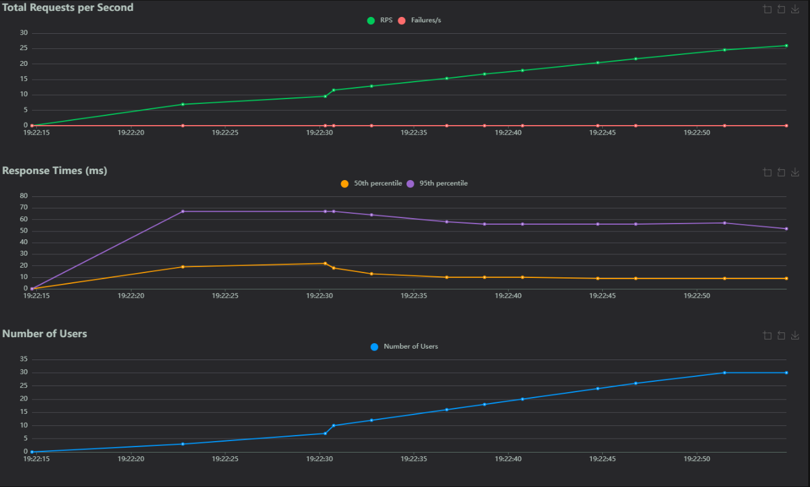
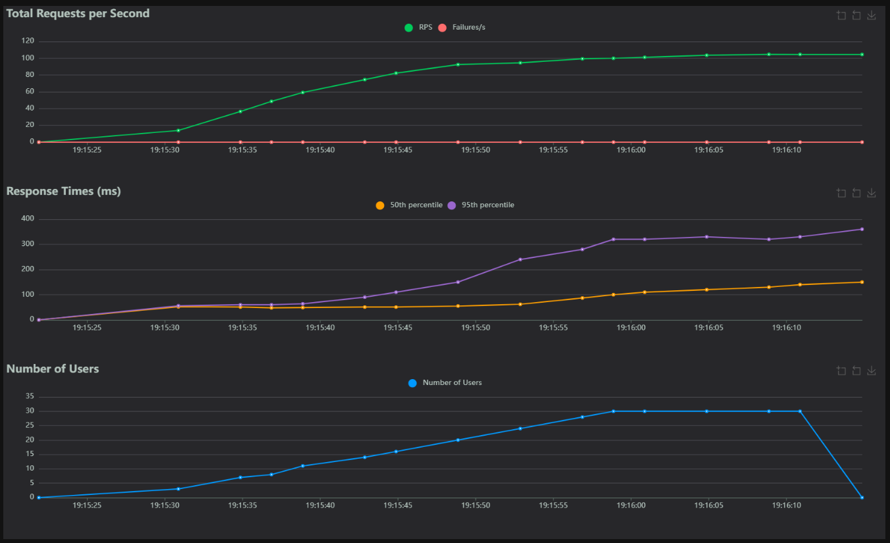

# AvitoTestTask

Сервис для автоматического назначения ревьюверов на Pull Request'ы внутри
команд.

## Как запустить

```bash
git clone https://github.com/IMixyI/AvitoTestTask.git
cd AvitoTestTask
docker-compose up
```

## Результаты нагручоного тестирования

Результаты нагрузочного тестирования массовой деактивации пользователей команды
с последующими перенезначениями открытых PRов:



Результаты нагрузочного тестирования всех типов запросов:



## Внесенные изменения и дополнения

- Добавлен код ошибки INTERNAL_ERROR
- Добавлен эндпоин массовой деактивации пользователей команды, с с последующими
  перенезначениями открытых PRов. При невозможности переназначения возвращает
  ошибку NO_CANDIDATE
- Добавлен эндпоинт статистики, показывающий сколько PRов создал каждый
  пользователь, не считая тех, кто их не создавал
